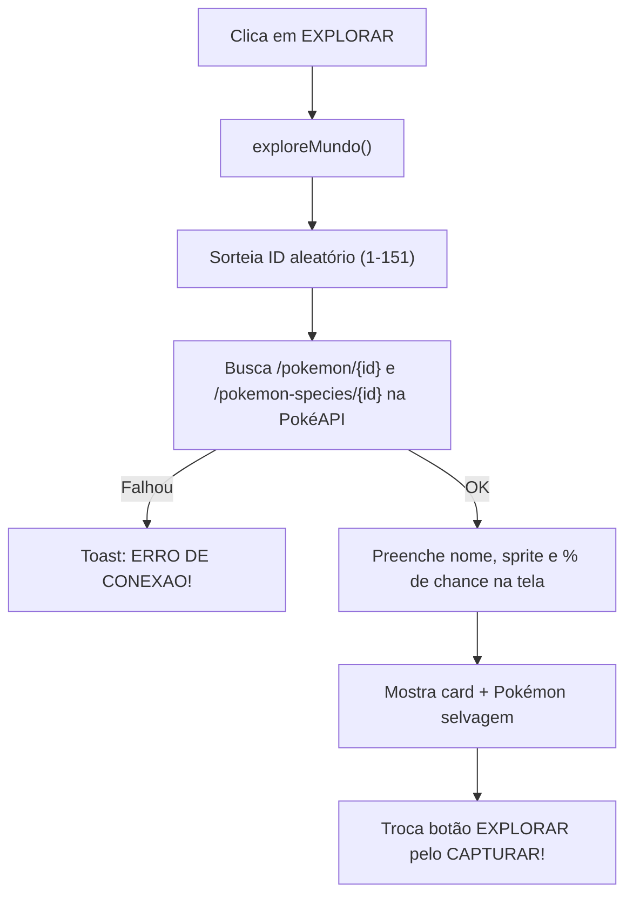
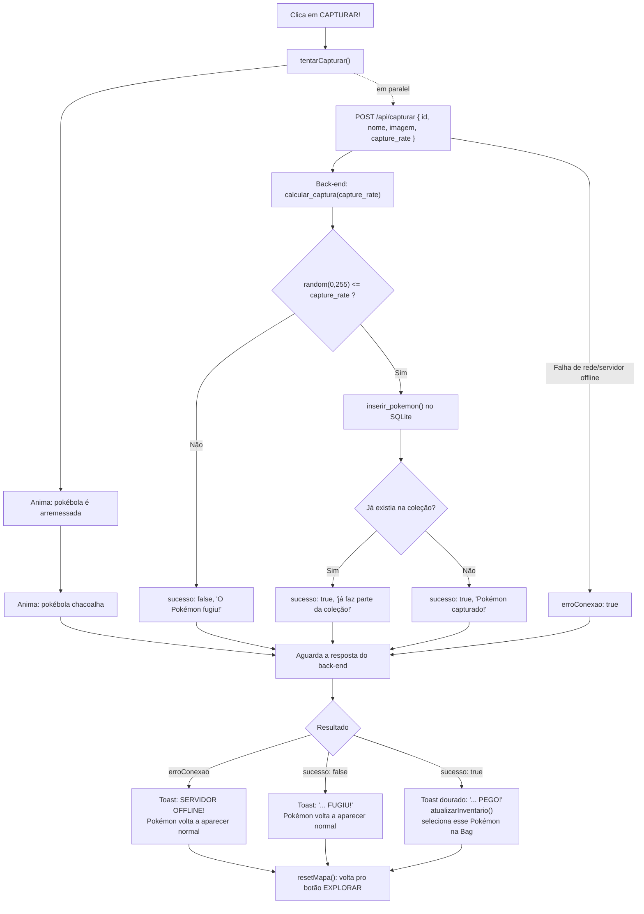
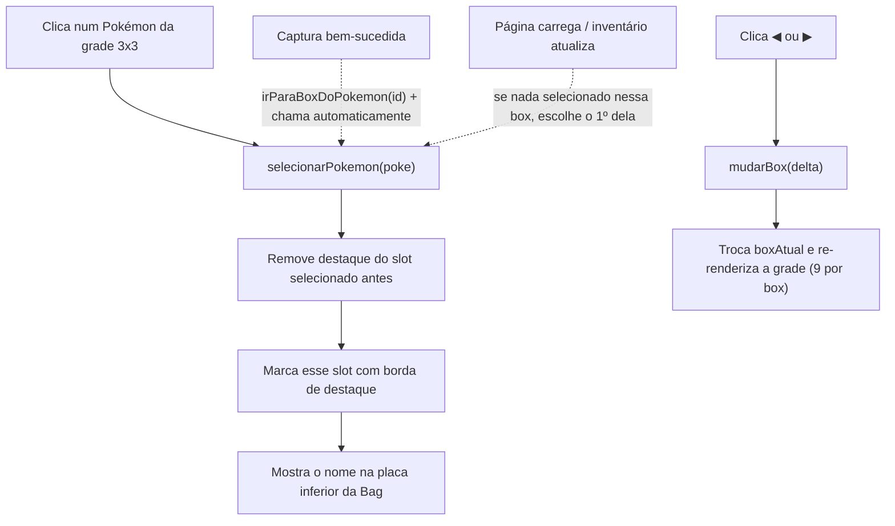
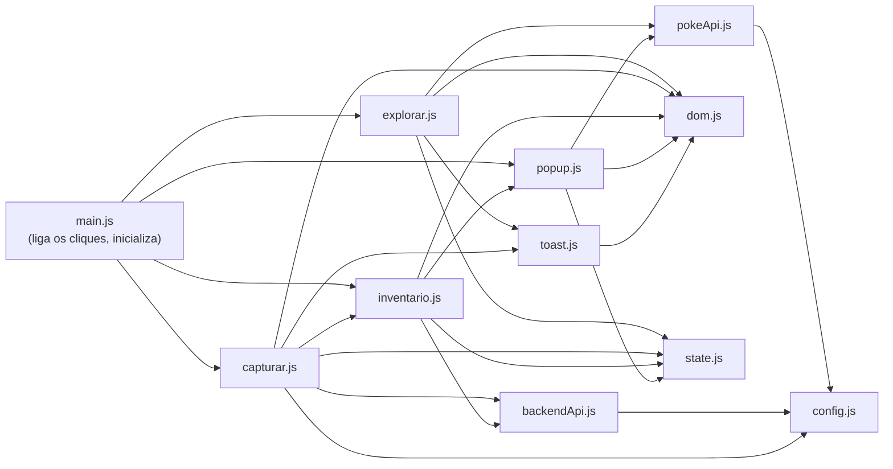

# Documentação Técnica: Jornada Pokémon

Documento técnico com todas as funcionalidades do jogo e o passo a passo de como cada
uma funciona por baixo dos panos. Para instruções de instalação/execução, veja o
[README](./README.md).

## Sumário

- [Funcionalidades](#funcionalidades)
- [Fluxograma: Explorar](#fluxograma-explorar)
- [Fluxograma: Capturar](#fluxograma-capturar)
- [Fluxograma: Selecionar na Bag](#fluxograma-selecionar-na-bag)
- [Arquitetura do front-end (JS)](#arquitetura-do-front-end-js)
- [Boas práticas de código aplicadas](#boas-práticas-de-código-aplicadas)
- [Referência rápida de funções](#referência-rápida-de-funções)

## Funcionalidades

### Exploração
- Botão **EXPLORAR** sorteia um ID de 1 a 151 (Pokémon de Kanto) e busca os dados
  direto na [PokéAPI](https://pokeapi.co) (`/pokemon/{id}` e `/pokemon-species/{id}`).
- Mostra sprite, nome e a **chance de captura real** da espécie (`capture_rate`,
  0–255, convertido para %).

### Captura
- Botão **CAPTURAR!** dispara a animação (pokébola é arremessada, chacoalha) e, em
  paralelo, chama o back-end (`POST /api/capturar`) pra decidir o resultado de verdade.
- Resultado depende só do back-end: `random(0, 255) <= capture_rate`. O front nunca
  decide sozinho se capturou ou não, só anima o que o back-end respondeu.
- Se sucesso: toast dourado, Pokémon entra no inventário e já fica selecionado na Bag.
- Se falha: toast de "fugiu", tela volta ao estado inicial.
- Se o back-end estiver fora do ar: toast "SERVIDOR OFFLINE" (não confunde com o
  Pokémon ter fugido, são coisas diferentes).

### Inventário / Bag
- Grade 3x3 (9 espaços) mostrando os Pokémon capturados, sincronizada com o
  back-end (`GET /api/inventario`) a cada mudança.
- **Sem limite de captura**: o back-end guarda quantos Pokémon únicos a pessoa
  pegar (até os 151 de Kanto). A grade só mostra 9 por vez; quando passa disso,
  vira **múltiplas boxes** (`BOX 1`, `BOX 2`...), igual o PC do Professor Carvalho
  nos jogos originais. Setas ◀ ▶ embaixo da Bag navegam entre elas.
- Clicar num Pokémon capturado **seleciona** ele (borda de destaque) e mostra o nome
  na placa inferior da Bag.
- Ao capturar um Pokémon novo, a tela **pula automaticamente pra box onde ele caiu**
  (a ordem é por `pokemon_id`, não por ordem de captura) e já seleciona ele.
- Slots vazios mostram uma pokébola apagada, de placeholder.
- Sem duplicatas: o back-end usa `UNIQUE` no `pokemon_id`. Tentar capturar de novo
  um Pokémon já coletado retorna sucesso, mas não duplica a linha no banco.

### Tratamento de erros
- Front-end: erro de rede na captura ou no carregamento do inventário nunca trava a
  tela: mostra mensagem e mantém o último estado bom conhecido.
- Back-end: toda rota tem `try/except`, erros de banco retornam `500` com detalhe via
  `HTTPException`, sem derrubar o servidor.

## Fluxograma: Explorar

## Fluxograma: Capturar

Esse é o fluxo principal do jogo: a animação no front e o cálculo real no back
acontecem **em paralelo**, e só se juntam no fim.

## Fluxograma: Selecionar na Bag

## Arquitetura do front-end (JS)

O `script.js` único virou módulos ES (`import`/`export`), cada um com uma
responsabilidade só, carregados a partir de `frontend/js/main.js`
(`<script type="module">` no `index.html`):

Repare que as setas só andam num sentido: não existe módulo A importando B que importa A de volta. Isso é deliberado, dependência circular entre módulos é um dos sintomas mais comuns de código mal separado.

## Boas práticas de código aplicadas

O `script.js` original tinha ~320 linhas fazendo tudo: buscar na PokéAPI,
falar com o back-end, manipular DOM, guardar estado e animar, no mesmo
arquivo, sem nenhuma fronteira entre essas responsabilidades (um "god file").
A refatoração pra módulos ES seguiu alguns princípios concretos:

**Responsabilidade única por módulo.** Cada arquivo faz uma coisa só e o
nome já entrega o quê: `pokeApi.js` só sabe conversar com a PokéAPI,
`backendApi.js` só fala com o back-end da Carol, `explorar.js` só cuida da
tela de encontro. Nenhum desses módulos mexe em DOM diretamente nem contém
`fetch()` fora do lugar certo.

**Fonte única de verdade.** Antes, o estado (`currentPokemon`, `inventario`,
`boxAtual`...) e as referências de elementos (`document.getElementById(...)`)
eram `let`/`const` soltos misturados com a lógica. Agora `state.js` é o único
dono do estado e `dom.js` o único que conhece os IDs do HTML; qualquer outro
módulo importa e usa, nunca redeclara.

**DRY (Don't Repeat Yourself).** A lógica de "tentar pegar o sprite animado
(Geração 5) da PokéAPI, com fallback pro estático" existia **duas vezes**:
uma dentro de `exploreMundo()`, outra dentro do popup da Bag. Virou uma
função só (`extrairSpriteAnimado`, dentro de `pokeApi.js`), usada nos dois
lugares.

**Funções pequenas, um nível de abstração cada.** `tentarCapturar()` fazia
animação, chamada de API e as três reações possíveis (sucesso, fuga, erro de
conexão) tudo junto. Foi quebrada em `tentarCapturar()` (orquestra) +
`reagirAoResultado()` (decide o que fazer com cada resultado). O mesmo pra
`renderizarInventario()`, que ganhou um `criarSlot()` separado em vez de
montar o HTML de cada slot dentro do próprio loop.

**Sem HTML acoplado a JS.** Os `onclick="..."` inline no `index.html` foram
trocados por `addEventListener` centralizado em `main.js`. HTML não precisa
mais saber o nome de nenhuma função JS, e é só em `main.js` que se descobre
o que cada botão faz.

**Constantes nomeadas em vez de números mágicos.** Os tempos de animação da
captura (500ms, 2500ms, 2000ms) viraram `DURACAO_ARREMESSO_MS`,
`DURACAO_ANIMACAO_MS` e `PAUSA_ANTES_DE_RESETAR_MS` no topo de
`capturar.js`; quem lê entende o porquê do número sem precisar rodar o código.

**Grafo de dependências sem ciclos.** Como mostra o diagrama acima, os
imports formam um DAG: dá pra entender qualquer módulo olhando só pra ele e
pro que ele importa, sem precisar carregar o app inteiro na cabeça.

## Referência rápida de funções

| Função (front) | Onde | O que faz |
|---|---|---|
| `exploreMundo()` | `frontend/js/explorar.js` | Sorteia e busca um Pokémon selvagem na PokéAPI. |
| `tentarCapturar()` | `frontend/js/capturar.js` | Anima a captura e chama o back-end pra decidir o resultado. |
| `resetMapa()` | `frontend/js/capturar.js` | Volta a tela pro estado inicial (botão EXPLORAR). |
| `atualizarInventario()` | `frontend/js/inventario.js` | Busca `GET /api/inventario` e re-renderiza a grade. |
| `renderizarInventario()` | `frontend/js/inventario.js` | Desenha os 9 slots da box atual a partir do `state.inventario`. |
| `mudarBox(delta)` | `frontend/js/inventario.js` | Troca `state.boxAtual` (±1) e re-renderiza; usado pelas setas ◀ ▶. |
| `irParaBoxDoPokemon(id)` | `frontend/js/inventario.js` | Acha em qual box um Pokémon caiu e pula pra ela (usado após capturar). |
| `selecionarPokemon(poke)` | `frontend/js/inventario.js` | Marca um Pokémon como selecionado e atualiza a placa de nome. |
| `abrirPopupPokemon(poke)` | `frontend/js/popup.js` | Abre o popup ao lado da Bag com o sprite (animado, se houver) e nome do Pokémon. |
| `fecharPopup()` | `frontend/js/popup.js` | Fecha o popup. |
| `buscarPokemonSelvagem()` | `frontend/js/pokeApi.js` | Sorteia um id (1-151) e busca sprites + `capture_rate` na PokéAPI. |
| `buscarSpriteAnimadoPorId(id)` | `frontend/js/pokeApi.js` | Busca só o sprite animado (Geração 5) de um Pokémon pelo id. |
| `capturarPokemon(pokemon)` | `frontend/js/backendApi.js` | `POST /api/capturar`; nunca rejeita, erro de rede vira `{erroConexao: true}`. |
| `buscarInventarioRemoto()` | `frontend/js/backendApi.js` | `GET /api/inventario`. |
| `showToast(msg, tipo)` | `frontend/js/toast.js` | Mostra a notificação retrô no topo da tela. |
| `dom` | `frontend/js/dom.js` | Objeto com todas as referências de elementos do HTML usadas pelo app. |
| `state` | `frontend/js/state.js` | Objeto com o estado do app (Pokémon atual, inventário, seleção, box atual...). |

| Função (back) | Onde | O que faz |
|---|---|---|
| `calcular_captura(capture_rate)` | `backend/game_logic.py` | `random(0,255) <= capture_rate` → `True`/`False`. |
| `criar_tabela()` | `backend/database.py` | Cria a tabela `inventario` se não existir (roda 1x, ao subir o servidor). |
| `inserir_pokemon(id, nome, sprite)` | `backend/database.py` | `INSERT OR IGNORE`; evita duplicata via `UNIQUE(pokemon_id)`. |
| `buscar_inventario()` | `backend/database.py` | `SELECT` de todos os Pokémon capturados, ordenado por `pokemon_id`. |
